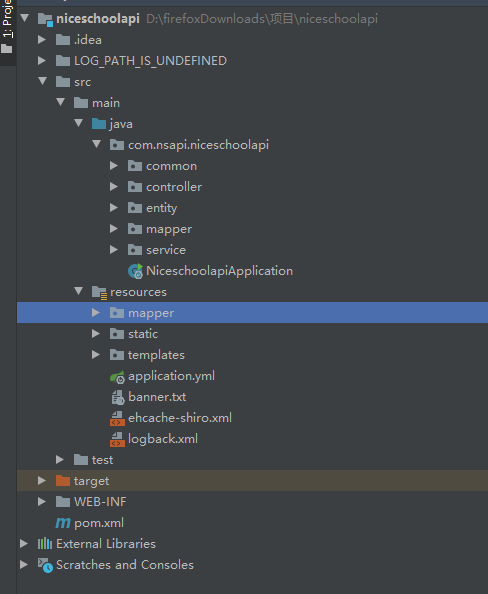
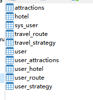

本系统是一个基于springboot景区管理系统

源码下载地址：http://www.manoncode.cn/details?id=49
```
springboot景区管理系统。该项目分为前台网站展示与后台管理。
前台网站主要功能有：用户登录、注册；首页有热门酒店、热门景点、景区游玩攻略、热门路线等模块；其次导航栏有景区游玩路线、我关注的路线；景区游玩攻略、我发布的攻略、我关注的攻略；在线酒店预订、景点预订、我的预订等；
后台管理主要功能有：用户管理、酒店管理、景点管理、攻略管理、路线管理等；
```

```
1. 后端：SpringBoot
2. 前端：html+layui+bootstrap+jQuery
```
```
1. 使用IDEA/Eclipse/MyEclipse导入项目，Eclipse/MyEclipse导入时，若为maven项目请选择maven;若为maven项目，导入成功后请执行maven clean;maven install命令，下载所需jar包；
2. 使用Navicat或者其它工具，在mysql中创建对应名称的数据库，并导入项目的sql文件；
3. 将项目中application.yml配置文件中的数据库配置改为自己的配置
4. 然后运行项目，输入localhost:8087/travel 登录
5. 后台管理员账户:admin  密码:admin
前台普通用户账户：user 密码：123456
```

CSDN博客地址：[基于springboot景区管理系统](https://blog.csdn.net/mataodehtml/article/details/121392771)

运行视频地址：[基于springboot景区管理系统](https://www.bilibili.com/video/BV1CR4y1E7EV)

用户：


.png)
.png)
.png)
.png)
.png)
.png)
.png)
.png)
.png)
.png)
.png)
管理员：
.png)
.png)
.png)
.png)


